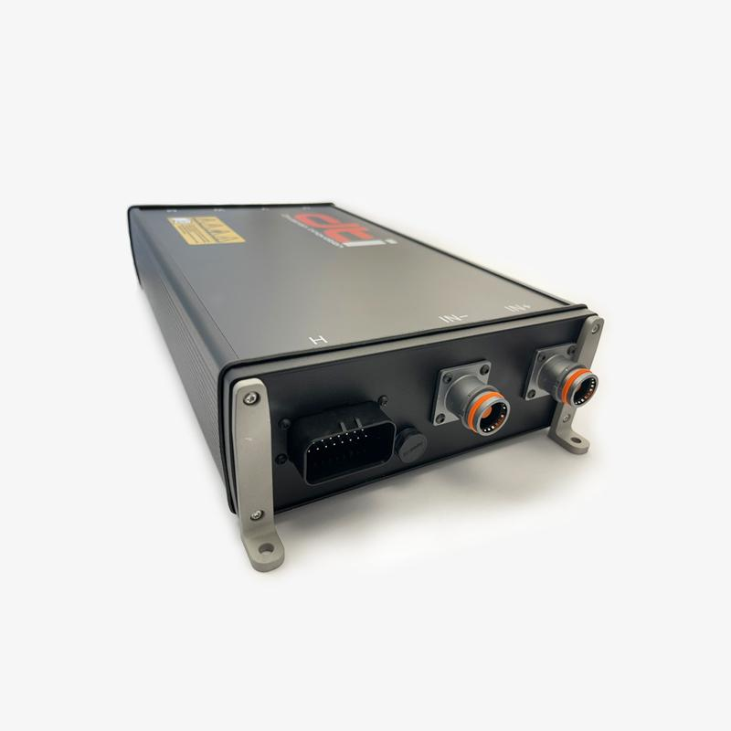
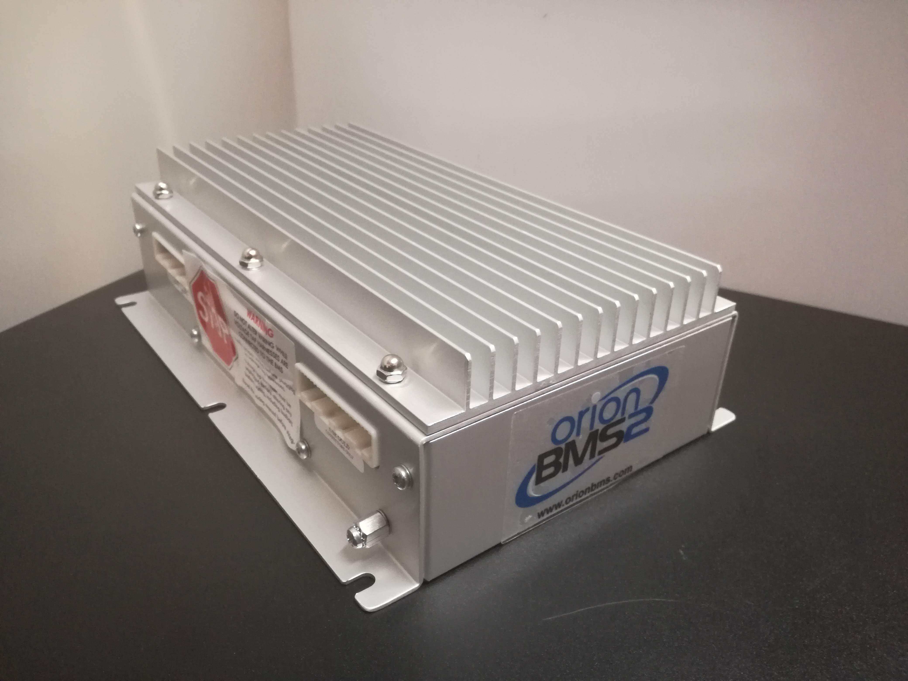
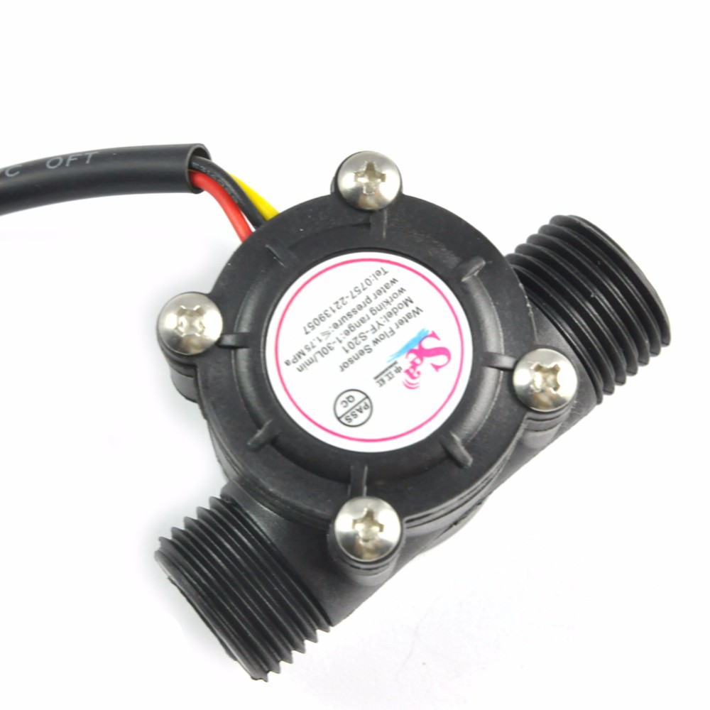
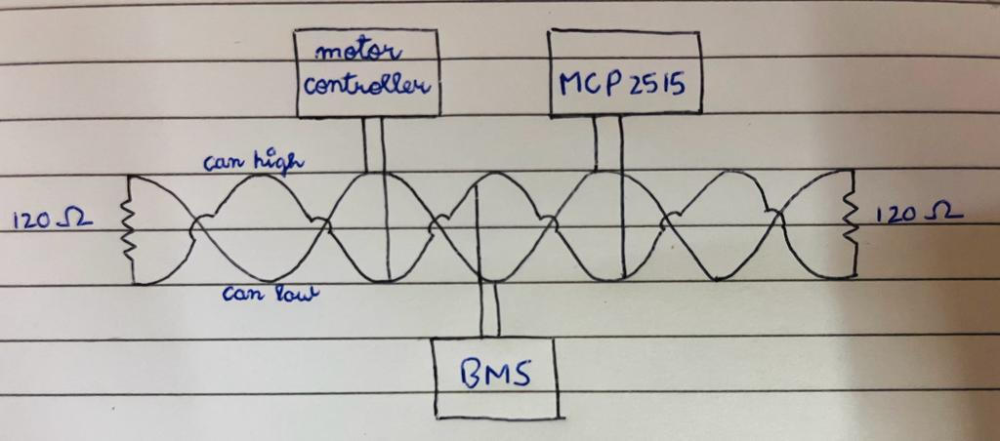
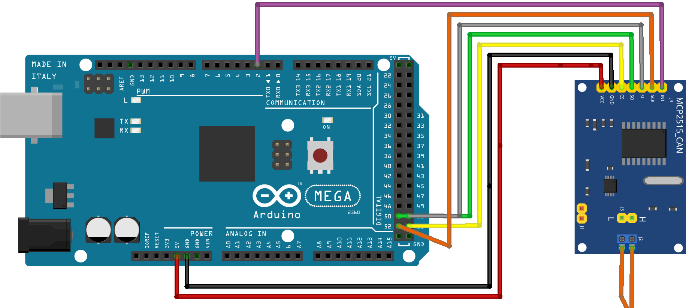

# Data-Acquisition-System
A data acquisition system (DAQ for short) created for Team Defianz Racing wherein we take data from various sensors and display them on dashboard screen as well as the pit screen.

## Table of Contents
- [Sensors-Used](#sensors-used)
- [Hardware-and-Modules](#hardware-and-modules)
- [Data-Extracted](#data-extracted)
- [Connections](#connections)
- [Steps-to-follow](#steps-to-follow)
- [My-Role](#my-role)
- [Credits](#credits)

## Sensors Used
We use the following sensors from which the data needs to be extracted:
1. Motor Controller: DTI HV 500 LC (https://drivetraininnovation.com/webshop/inverters/dti-hv-500-liquid-cooled)

2. Battery Management System(BMS): BMS Orion 2 (https://www.orionbms.com/products/orion-bms-standard)

3. Mass Flow rate Sensor (MFR)

## Hardware and Modules
1. CANBUS wiring(twisted) with two 120 ohm resistors at both ends: to communicate with Motor Controller and BMS
2. MCP2515 module: to communicate between CANBUS and Arduino
3. Arduino Mega 2560: to process the data received by all the sensors and convert it into useable form
4. Raspberry Pi 4: to receive the data from Arduino and display it on the dashboard screen with appropriate UI
5. HC12 module: for telemetry, i.e, send the real time data from sensors to the pit station where teams can review it and also perform data logging
6. Buck Converter: to convert the 12V DC (from LV battery) into a constant 5V DC supply to power the Arduino and Raspberry pi

## Data Extracted
We fetch the following data:
1. From Motor Controller: Motor Temperature, Motor Controller Temperature, ERPM, Throttle
2. From BMS: Accumulator current, Accumulator Voltage, State of charge, Highest temperature of a cell in the battery, lowest temperature of a cell in the battery
3. From MFR: Speed of the fluid in the cooling system tubes (unit: L/minute)

## Connections
1. Connect the CAN2.0 High and CAN2.0 Low wires of Motor Controller and BMS to the CANBUS wiring. Make sure these nodes are connected in parallel.
2. Also connect the MCP2515 module in parallel to the nodes.

3. Now connect the MCP2515 with the Arduino Mega in the following way:

4. Also connect the MFR sensor to the arduino. The 'data' wire should go in pin 4 of arduino. And the V+ve and V-ve wires should go in 5V and GND pins respectively.
5. Connect the HC12 module such that it's RX and TX pins are connected to pin 10 and pin 11 of the arduino respectively. Also it's Vcc and GND pins should be connected to the 5V and GND pins of arduino

6. Power the arduino using Type A to Type B connector from the raspberry pi
7. Raspberry pi should get it's power from the general GPIO pins which are connected to the LV battery via a buck converter. The buck converter's potentiometer should be adjusted such that it converts the 12V input into 5V output

8. Raspberry pi should further be connected to the monitor present in the dashboard

## Steps to follow
1. Establish the connections as mentioned above. Initially connect the arduino to your personal laptop instead of the raspberry to upload a code.
2. On your personal laptop (having the arduino IDE), install the libraries:
	1. arduino-mcp2515 (https://github.com/autowp/arduino-mcp2515/archive/master.zip)
	2. mcp-can.h (https://downloads.arduino.cc/libraries/github.com/coryjfowler/mcp_can-1.5.0.zip)
3. In the arduino IDE, go to Sketch -> Include Library -> Add .ZIP Library and add the .zip files for both the libararies you just downloaded.
4. Upload the merged-arduino-code.ino onto the Arduino Mega 2560 using the IDE.
5. Open Serial Monitor with Ctrl+Shift+M to ensure data is coming in properly and the output is appropriate
6. Close the arduino IDE. Disconnect the arduino from your personal laptop and connect it back to the raspberry pi.
7. Power up the raspberry pi and copy the entire folder of UI onto it.
8. Run the file gui_returns.py by first navigating to the path where you copied the UI folder in the terminal. Then typing:
python3 'folder-name' gui_returns.py
	

## My Role
I took the exhausting task of extracting data from the Motor Controller. This included figuring out the right CAN wires from the sensor, establishing a connection between the sensor and CANBUS, writing the code to convert the raw CANBUS data into useable form and passing it on to the raspberry.

For this I referenced the HV 500 CAN Manual v2.3 (https://drive.google.com/file/d/1XwL7rdQBQ7feo0aQrrRIpNbMYhYFmUrn/view), the HV 500 DBC file v2.4 (https://drive.google.com/file/d/1Ab0_CAaa5hfugyvFDeBGb3mmrNucd-Ci/view), and alot of other miscellaneous websites. I also then managed sensor fusion, i.e, merging the codes extracting data from all the sensors, and preparing a final code which delivered data according to the need of the UI code. This final code had to go through several iterations to make it as efficient as possible thereby reducing the latency.

I also managed the team of Software recruits of Team Defianz Racing ensuring everyone completed their tasks up to the mark.

## Credits
1. Satwik Jain (https://github.com/satwikjain23): Handling the gigantic task of receiving data from BMS, and converting it from raw CANBUS data into useable form.
2. Ayan Mahajan: Handling the entire UI aspect ranging from displaying data on screen after receiving it from arduino, managing the pit screen and performing data logging as well.
3. Raman Saini (https://github.com/Raman-Saini9): Handling the wiring and making sure each component receives appropriate power. Also extracting data from MFR.
4. Monis (https://github.com/Monis6113): Helping in figuring out Data logging and telemetry.
5. Ayush Jain (https://github.com/ayushjain143): Managing the telemetry aspect of the DAQ.
